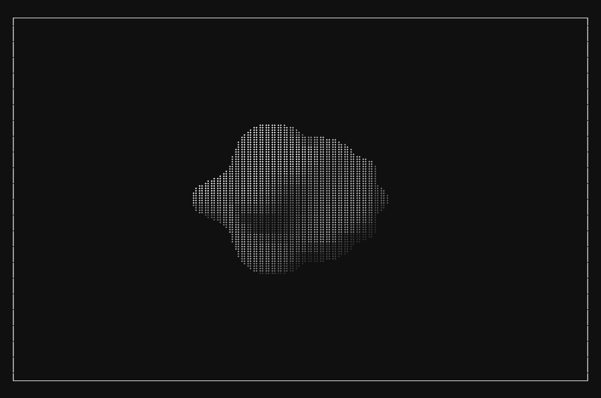
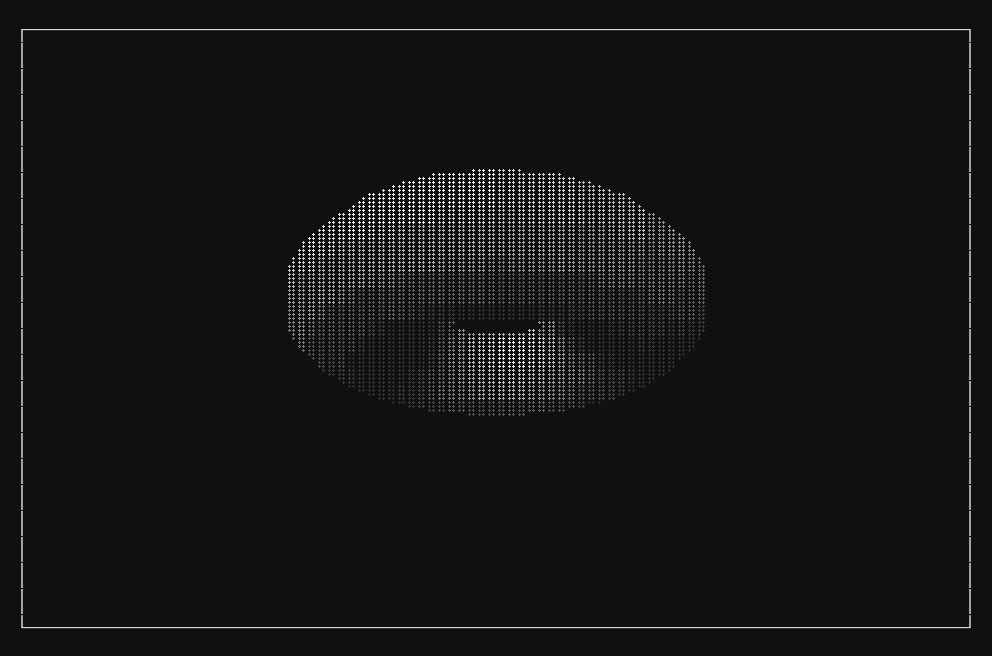
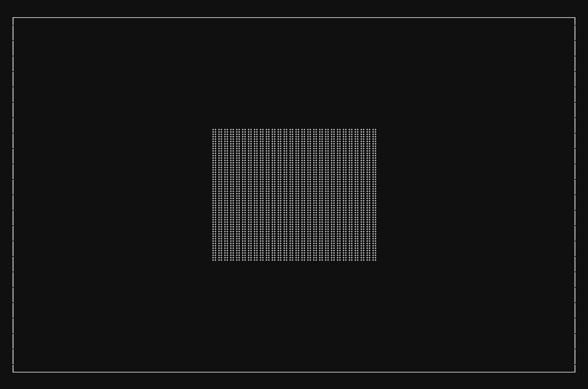

# Terminal Renderer

Simple 3D renderer inside the terminal, written in C with no external dependencies. Supports both rasterization and raymarching with signed distance fields, all running on the CPU. The image is made with Braille characters, with ANSI codes for colors and the TUI.

## Raymarcher

<table>
  <tr>
    <td align="center" width="50%">
      
       
      Torus SDF
    </td>
    <td align="center" width="50%">
      
       
      Sphere SDF with surface displacement
    </td>
  </tr>
</table>

## Rasterizer

<table>
  <tr>
    <td align="center" width="50%">
      
       
      Torus
    </td>
    <td align="center" width="50%">
      
       
      Cube
    </td>
  </tr>
</table>
